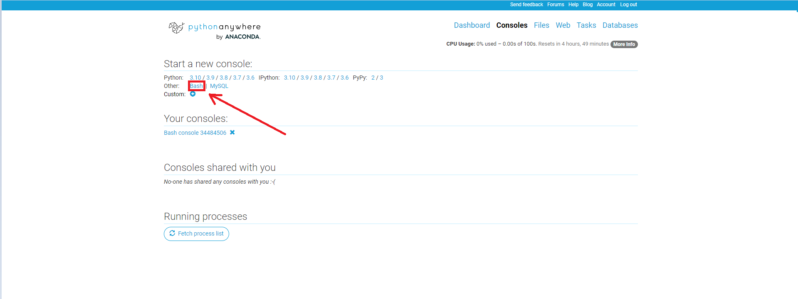
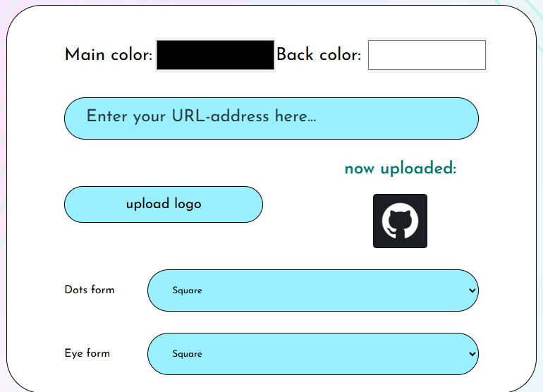

# QR-code generator app

<details>
<summary>
English version
</summary>
<p></p>
QR-code generator app is an app for generating QR codes with the ability to create both standard and desktop codes. It supports customization: changing colors, shapes, and the option to add a logo to the QR code. A convenient tool for creating unique QR codes for various purposes.

---
### Information
- [Installation and Setup](#installation-and-setup)
- [Contributors](#contributors)
- [Structure of the project and applications](#project-structure)
- [Technologies We Used](#technologies-we-used)
- [QR Codes](#qr-codes)
- [Conclusion](#conclusion)
---

# Installation and Setup

1. Get the repository link


2. Clone the repository
```sh
git clone https://github.com/dimachep1408/QR-code_generator_app.git
```

3. Navigate to the project directory
```sh
cd QR-code_generator_app
```

<details>
<summary>
Windows
</summary>
<p></p>

1. Create a virtual environment
```sh
python -m venv venv
```

1. Activate the virtual environment
```sh
.\venv\Scripts\activate
```

1. Install dependencies from the requirements.txt file
```sh
pip install -r requirements.txt
```

1. Run the project
```sh
python manage.py runserver
```
</details>

<details>
<summary>
MacOS
</summary>
<p></p>

1. Create a virtual environment
```sh
python3 -m venv venv
```

1. Activate the virtual environment
```sh
source venv/bin/activate
```

1. Install dependencies from the requirements.txt file
```sh
pip3 install -r requirements.txt
```

1. Run the project
```sh
python3 manage.py runserver
```
</details>
<p></p>

# Contributors
1. [Dmytro Chepikov](https://github.com/dimachep1408)
2. [Dmytro Lomako](https://github.com/DmytroLomako)
3. [Misha Barylo](https://github.com/Mbarilo)
4. [Feliks Denga](https://github.com/Feliks2010)

---

# Project structure


# Application structure


---

# Technologies We Used

* Django – framework for backend and request processing.
* qrcode – generation and customization of QR codes.
* Pillow – working with images, saving QR codes.
* os – file system management, saving images.
* datetime – storing the creation time of the QR code.

---

# QR Codes

#### When generating a QR code, you can customize the following parameters:

* Data – link.
* Color – you can change the background and foreground colors.
* Logo – you can insert an image in the center of the QR code (e.g., a company logo).
* Dots form – shape of the QR code dots.
* Eye form – shape of the "eyes" (large squares in the corners of the QR code).

#### Desktop Subscription
For convenience, a desktop version of the service with a subscription can be implemented, allowing the creation of special "desktop" QR codes that can store text, contact information, and more.

---

# Conclusion

While working on the QR-Code Generator App, our team gained valuable experience in developing web applications with Django. We deepened our understanding of the framework’s structure, route configuration, form handling, and integration with external libraries for generating and customizing QR codes.

One of the main challenges was implementing flexible design settings for QR codes—changing colors, shapes, and adding logos. This allowed us to better understand working with graphic formats and image optimization.

Overall, the QR-Code Generator App became a great practical project for us, helping not only to reinforce our knowledge of Django but also to explore new approaches to working with graphics, integrating custom features, and improving the user experience.

---
</details>
<p></p>


QR-code generator app - додаток для генерації QR-кодів з можливістю створення стандартних та десктопних кодів. Підтримує кастомізацію: зміна кольору, форми та можливісь додати логотип до qr-коду. Зручний інструмент для створення унікальних QR-кодів для різних потреб.

---
### Інформація
- [Інсталяція та налаштування](#інсталяція-та-налаштування)
<!-- toc-disable -->
- [Учасники проекту](#учасники-проекту)
<!-- toc-disable -->
- [Структура проекту та додатків](#структура-проекту)
<!-- toc-disable -->
- [Технології які ми використовували](#технології-які-ми-використовували)
<!-- toc-disable -->
- [QR-коди](#qr-коди)
<!-- toc-disable -->
- [За що відповідає кожен додаток](#за-що-відповідає-кожен-додаток)
<!-- toc-disable -->
- [Висновок](#висновок)
<!-- toc-disable -->
---

## <a src = "https://www.figma.com/design/bf3kkFSzNPwspbII8GaT3M/Untitled?node-id=0-1&node-type=canvas&t=ARWbS6jiX0W94etK-0">Посилання на дизайн у Figma</a> 

# Інсталяція та налаштування

1. Отримання посилання на репозиторій


2. Клонування репозиторію
```sh
git clone https://github.com/dimachep1408/QR-code_generator_app.git
```

3. Перехід до директорії проекту
```sh
cd QR-code_generator_app
```

<details>
<summary>
Windows
</summary>
<p></p>

4. Створення віртуального оточення
```sh
python -m venv venv
```

5. Активація віртуального оточення
```sh
.\venv\Scripts\activate
```

6. Встановлення залежностей з файлу requirements.txt
```sh
pip install -r requirements.txt
```

7. Запуск проекту
```sh
python manage.py runserver
```
</details>

<details>
<summary>
MacOS
</summary>
<p></p>

4. Створення віртуального оточення
```sh
python3 -m venv venv
```

5. Активація віртуального оточення
```sh
source venv/bin/activate
```

6. Встановлення залежностей з файлу requirements.txt
```sh
pip3 install -r requirements.txt
```

7. Запуск проекту
```sh
python3 manage.py runserver
```
</details>
<p></p>

---

**Віддалено (на PythonAnywhere):**
   - Увійдіть у свій акаунт на [PythonAnywhere](https://www.pythonanywhere.com/).
   - Перейдіть на вкладку "Consoles"
    
   - Нажміть на bash 
   - Копіювати посилання проекта
   - Повернутися у консоль та написати `cd mysite`
   - Повирнутися у консоль та написати `git clone (Вставити ссилку)`
   - Повернутися у вкладку web та заминити "Code" як на зображені [](image-6.png)
   - Та нажати на вкладку "wsgi configuration"
   - Тепер треба замінити 16 рядок як на фото
   - 
   - Нажати на save Справа зверху, та повертаємось на сторінку назад
   - Повертаємось у консоль та прописуємо `cd ../.virtualenvs` та натискаємо Enter, пишемо `python -m venv shop_venv`, `cd bin` і `source activate`

   - Далі встановлюємо всі модулі які прописані вищє за допомогою `pip install назва модуля`
   - повернутися до web та оновити
   - натиснути на силку 

---

# Учасники проекту
1. [Dmytro Chepikov](https://github.com/dimachep1408)
2. [Dmytro Lomako](https://github.com/DmytroLomako)
3. [Misha Barylo](https://github.com/Mbarilo)
4. [Feliks Denga](https://github.com/Feliks2010)

---

# Структура проекту


# Структура додатків


---

# Технології, які ми використовували

* Django - фреймворк для бекенду та обробки запитів.
* qrcode – генерація та кастомізація QR-кодів.
* Pillow – робота із зображеннями, збереження QR-кодів.
* os – керування файловою системою, збереження зображень.
* datetime – збереження часу створення QR-коду.

---

# QR-коди

#### При генерації QR-коду можна налаштовувати такі параметри:


* Дані – посилання.
* Колір – можна змінювати колір фону та переднього плану.
* Логотип – можна вставити зображення у центр QR-коду (наприклад, логотип компанії).
* Dots form – форма точок QR-коду:
* Eye form – форма «очей» (великих квадратів у кутах QR-коду):

        
# Підписки

### free
Цей вид підписки не потребує грошей, він буде доступен по стадндарту після реєстрації, тому так і називаєтся. Включає один qr-код
### standart
Цей вид підписки потребує 2$ у місяць та дає максимум 10 qr-кодів
### pro
Ця підиска дає цілих 100 qr-кодів але і кшотує 5$ у місяць
### desktop
---

#### Десктопна підписка
Для зручності можна реалізувати десктопну версію сервісу з підпискою, що дозволяє зробити окремі "desktop" qr-коди, які можуть зберігати якийсь текст, контактну інформацію ...

---
# За що відповідає кожен додаток
## block_qr_code 
    Цей додаток потрібен щоб перевіряти чи дієдіяльний qr-код, алгоритм дій:
    1. Отримує дані місяця на сьогодняшний день, та перевіряє чи є qr-коду 6 місяців, якщо є- показує на сторінці текст "Срок qr-коду вийшов"
    2. Перевіряєтся чи працює qr-код, дані про це беруться з відповідної строці у базі даних, якщо він не працює то відображає на сторінці текст "Цей qr-код заблокований"
    3. Перевіряєтся чи десктопний qrк-код, якщо він десктопний то показує повідомлення з цього qr-кода
    якщо не десктопний то переносить на сторінку яка була вказана у qr-коду
## contacts
    Цей додаток потрібен щоб відобразити контактну інформацію про нашу команду
## create_qr_code
Цей додаток потрібен щоб створити qr-код

Алгоритм для створення qr-коду:
1. Формування зображення яке загрузили на клієнтской частині сайту
2. Створення об'єкт контейнеру для qr-коду, за допомогою модуля "qrcode"
3. Додавання інформації(url) до qr-коду яка також вводиться у клієнтскій частині сайта, 
4. Із об'єкту інформації про qr-код цей об'єкт перетворюєтся на об'єкт самого qr-коду
5. Генерація картинки, з данних та контейнеру для qr-коду які було создано раніше
6. Отримання максимальної кількості qr-кодів із підписки
7. Перевірка чи десктопний qr-код
    - Не десктопний:
        1. Перевірка якщо логотип є:

            За допомогою модуля pillow додавання картинки до центру хображення з qr-кодом
            
            
        2. Сохранення qr-коду до локальних файлів
        3. Створення об'єкту в базі даних
    - Десктопний:
        1. Отримання максимальної кількості qr-кодів, яка храниться у строчці desktop
        2. Перевірка якщо логотип є:

            За допомогою модуля pillow додавання картинки до центру хображення з qr-кодом

            
        3. Перевірка якщо у користувача є десктопна підписка
            - Якщо є:
                
                - Зберігання картинки до локальних файлів
                - Зберігання до бази даних
## home
Цей додаток потрібен щоб показати інформацію про сайт, та кожен вид підписки

## login
    Цей додаток потрібен щоб авторизуватися користувачу
## my_qr_codes
    Цей додаток потрібен щоб показувати всі qr-коди
## payment
    Цей додаток включає у себе три кроки
        1. Введення інформації про email
        2. Відправка 6-значного коду на email та зберігання його у модель у базі даних, запипт користувача  про код
        3. Введення реквизитів карти та отримання вибраної підписки

## payment_pro
    Цей додаток включає у себе три кроки
        1. Введення інформації про email
        2. Відправка 6-значного коду на email та зберігання його у модель у базі даних, запипт користувача  про код
        3. Введення реквизитів карти та отримання вибраної підписки

## payment_desktop
    ## payment
    Цей додаток включає у себе три кроки
        1. Введення інформації про email
        2. Відправка 6-значного коду на email та зберігання його у модель у базі даних, запипт користувача  про код
        3. Введення реквизитів карти та отримання вибраної підписки
## registration
    Цей додаток потрібен щоб користувач міг зареєструватися

# Висновок
Працюючи над QR-code Generator App, наша команда здобула цінний досвід у розробці веб-додатків на Django. Ми краще розібралися у структурі цього фреймворку, налаштуванні маршрутів, роботі з формами та взаємодії із зовнішніми бібліотеками для генерації та кастомізації QR-кодів.

Окремим викликом стало впровадження гнучких налаштувань дизайну QR-кодів — зміна кольорів, форм та додавання логотипів. Це дало нам змогу глибше зрозуміти роботу з графічними форматами та оптимізацією зображень.

Загалом, QR-code Generator App став для нас чудовим практичним кейсом, який допоміг не лише закріпити знання з Django, а й освоїти нові підходи до роботи з графікою, інтеграцією кастомних функцій та покращення користувацького досвіду.

---

## Проблематика
### Дизайн
Спочатку у нас були проблеми з дизайном. 1-й варіант нам не сподобався, 2-й був зовсім не практичний і ми довго не могли вирішити, який саме дизайн ми будемо використовувати, але ми зупинись на такому красивому и практичному варіанті дизайну.
### Створення QR-кодів
Ми дуже довго тестували функцію створення QR-кодів та видів їх змінювання. Але ми, все ж таки змогли це зробити
